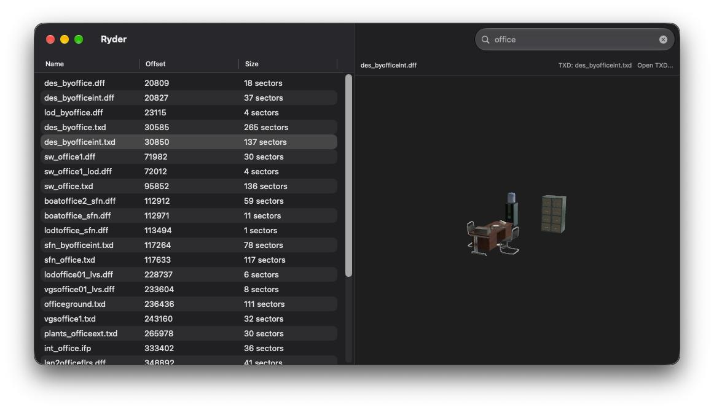

#  Ryder
A native macOS viewer for .img files from Rockstar 3D-era games.

## Building

Initialize and compile the bundled `librw` parser before opening the Xcode project:

```sh
git submodule update --init --recursive
./Scripts/build-librw.sh
```



